## Overview

[](https://github.com/jagrat7/linux-wallpaper-engine/releases) [](https://github.com/jagrat7/linux-wallpaper-engine/releases/latest)

This is a modern UI wrapper for [linux-wallpaperengine](https://github.com/Almamu/linux-wallpaperengine). This app has most features of [linux-wallpaperengine](https://github.com/Almamu/linux-wallpaperengine) plus some additional features(like compatibility tagging for wallpapers) for a better user experience. Also a shoutout to [simple-linux-wallpaperengine-gui](https://github.com/Maxnights/simple-linux-wallpaperengine-gui), which I referenced for CLI commands.


---

### 📑 Table of Contents

- [Installation](#-installation)
- [Features](#-features)
- [Future Features](#-future-features)
- [Contributing & Feedback](#-contributing--feedback)

---

## 📦 Installation

### 1. Wallpaper Engine (Steam)

You need to own and install [Wallpaper Engine](https://store.steampowered.com/app/431960/Wallpaper_Engine/) on Steam. Open Wallpaper Engine via Steam so the wallpapers are downloaded to your system.

### 2. Install linux-wallpaperengine

You need to go to the [linux-wallpaperengine repo](https://github.com/Almamu/linux-wallpaperengine) page and follow the build instructions to compile and install it. Please read carefully and make sure it supports your OS and configuration — if it doesn't, this app is useless.

Verify it works in your terminal:

```bash
linux-wallpaperengine
```

You might need to create a symlink to make the binary accessible in your `$PATH`:

```bash
# If installed to /opt (common)
sudo ln -sf /opt/linux-wallpaperengine/linux-wallpaperengine /usr/local/bin/linux-wallpaperengine

# Or from a custom build directory
sudo ln -sf /path/to/your/build/linux-wallpaperengine /usr/local/bin/linux-wallpaperengine
```

### 3. Linux Wallpaper Engine UI

Grab the latest package from [GitHub Releases](https://github.com/jagrat7/linux-wallpaper-engine/releases) for your distro.

#### Debian / Ubuntu (.deb)

```bash
sudo apt install ./linux-wallpaper-engine_<version>_amd64.deb
```

#### Fedora / RHEL (.rpm)

```bash
sudo dnf install ./linux-wallpaper-engine-<version>.x86_64.rpm
```

#### Flatpak

```bash
flatpak install --user ./com.github.jagrat7.LinuxWallpaperEngine_stable_x86_64.flatpak
```

#### ZIP (Portable)

```bash
# Extract the archive (use your preferred tool: unzip, 7z, etc.)
unzip linux-wallpaper-engine-<version>-linux-x64.zip

# Run the executable
cd linux-wallpaper-engine-linux-x64
./linux-wallpaper-engine
```

#### Nix / NixOS (Flakes)

Run the app without installing (flakes must be enabled):

```bash
nix run github:jagrat7/linux-wallpaper-engine
```

On NixOS, add the flake as an input:

```nix
# flake.nix
{
  inputs = {
    linux-wallpaper-engine.url = "github:jagrat7/linux-wallpaper-engine";
    # ...
  }
  # your system outputs...
}
```

Then simply consume the package:

```nix
# in a NixOS system module...
{ inputs, pkgs, ... }:
{
  environment.systemPackages = [
    inputs.linux-wallpaper-engine.packages.${pkgs.stdenv.hostPlatform.system}.default
    # ...
  ];
}

# or in a home-manager module...
{ inputs, pkgs, ... }:
{
  home.packages = [
    inputs.linux-wallpaper-engine.packages.${pkgs.stdenv.hostPlatform.system}.default
    # ...
  ];
}
```


## ✨ Features

- **Wallpaper Gallery** — Browse all your Steam Workshop wallpapers in a responsive, animated grid with thumbnails. You can add filters and sorts to make it easier to find the wallpapers you want.
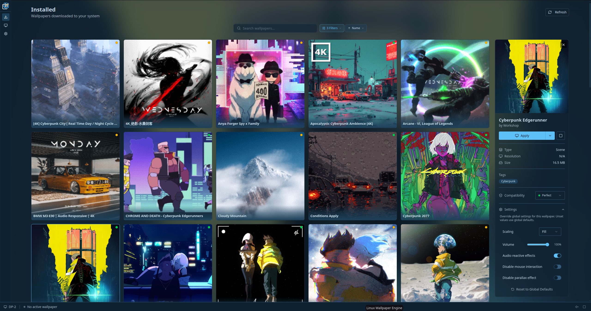

<br />

- **Playlists (NEW!)** —  You can create and apply playlists to group wallpapers together and apply them to your monitors.
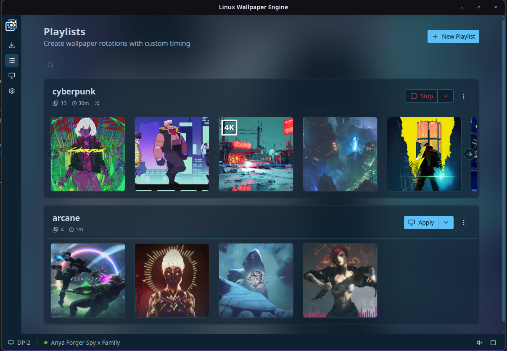

<br />

- **Compatibility/Errors tracking** —  You can manually tag the wallpapers as compatible or not from the settings or run the compatibility scanner to bulk-tag them, it's not 100% accurate but it will get you close. You can filter out wallpapers with errors or compatibility issues so you don't see them in the gallery.
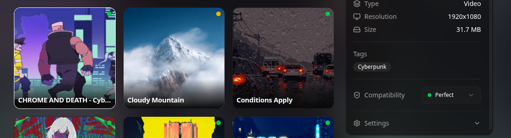
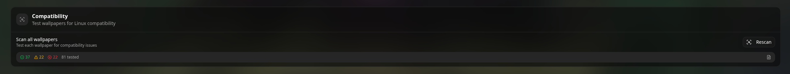

  - Wouldn't be a linux experience without it not working on your system. Enter **debug mode** when applying a wallpaper to see what's happening:
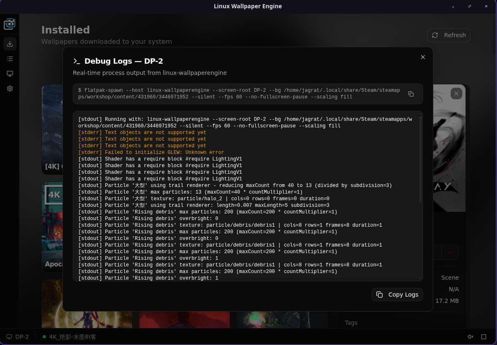
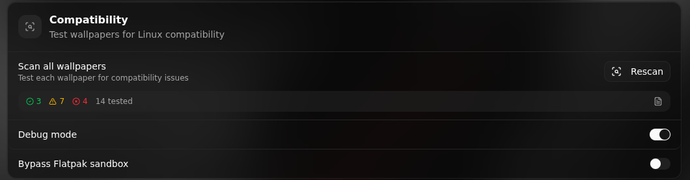
<br />

- **Multi-Monitor Support** — Detect all connected displays, apply different wallpapers per screen, and view your monitor layout at a glance
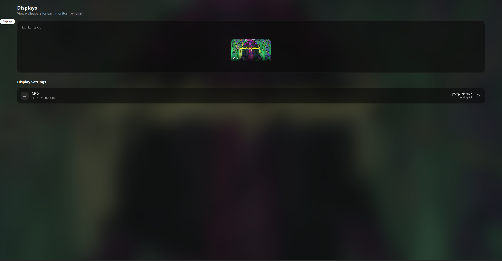

<br />

- **Theming** — Choose from Light, Dark, Steam, Hard Light, or System themes
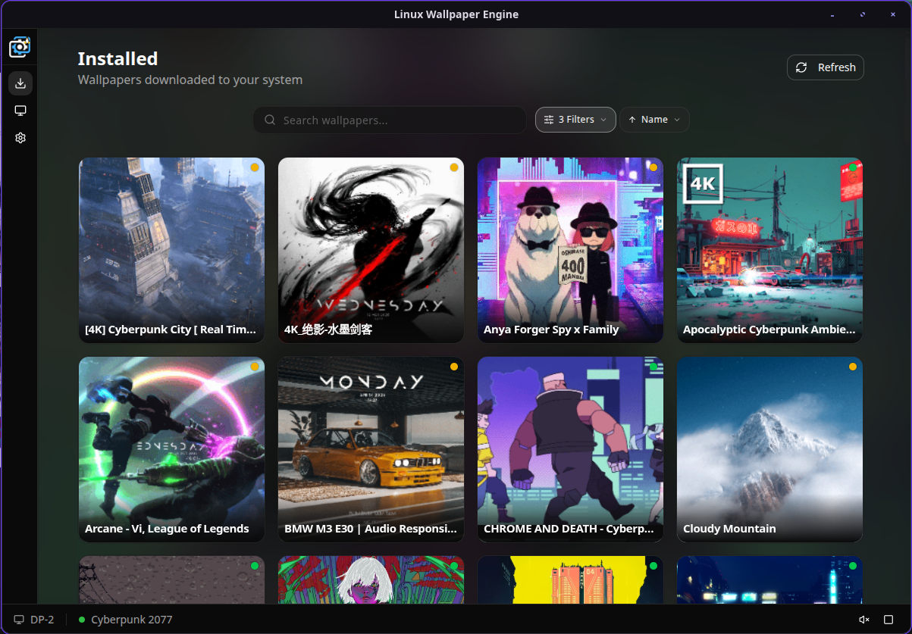
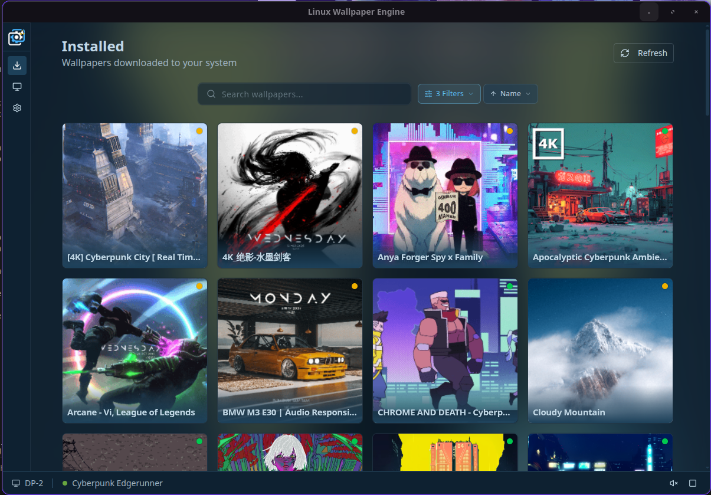
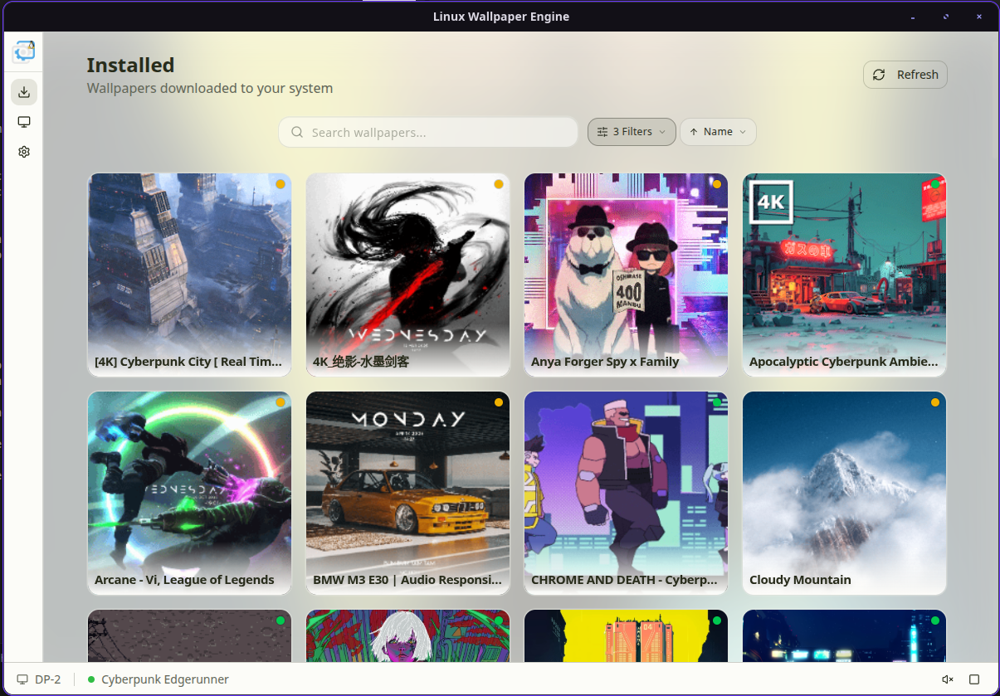

<br />

- **Settings** — Comprehensive options to tailor the application to your needs:
  - **Performance**: Manage resource usage with FPS limits, auto-pause on fullscreen, and startup preferences.
  - **Compatibility**: Built-in tool to scan and verify which Steam Workshop wallpapers run natively on Linux.
  - **Audio**: Control master volume, mute rules, and enable audio processing for reactive wallpapers.
  - **Display**: Adjust default scaling, toggle mouse interactions, and manage parallax effects.
  - **Appearance**: Switch themes (Light, Dark, Steam-like) and customize UI elements like the status bar.
  
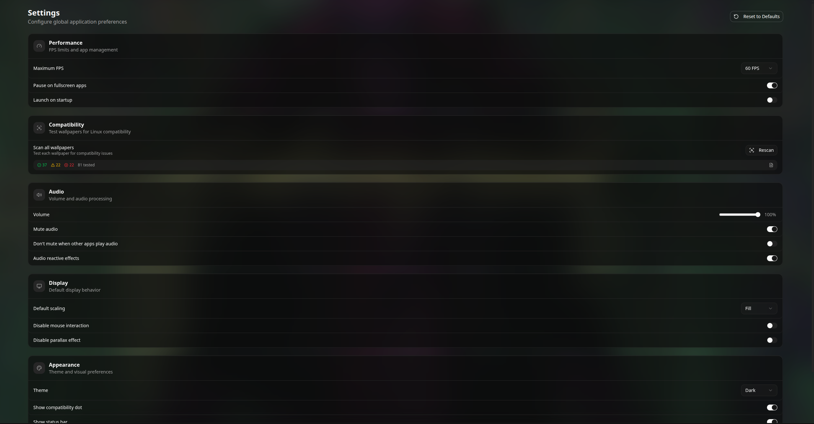

## 🔮 Future Features

- A single installation for both the backend and the UI.
- Make per-wallpaper settings dynamic.


## 🤝 Contributing & Feedback

Contributions and feedback are welcome! Checkout [Discussions](https://github.com/jagrat7/linux-wallpaper-engine/discussions) to vote on features, share ideas, or ask questions. You can also open an [issue](https://github.com/jagrat7/linux-wallpaper-engine/issues) or submit a pull request. See [CONTRIBUTING.md](../.github/CONTRIBUTING.md) for more info.
